---
nav_name:
name:
title:
date_initial:
date_edited:
description:
---
# Granger's Test for Causality On Gold Prices

Given two time series $Y_{t}, X_{t}$ Granger's test for
causality is a statistical test to see if $Y_{t - \gamma}, \gamma > 0$ has
predictive significance on $X_{t}$. Grangers test is a weaker test for causality
in that the test only fulfills the conditions for the Humean definition for
causality. Hence the motivation for this piece is to see if Granger causality
will be sufficient on fitting a useful model.

## Article Source Code
Code for the project can be found here:

## Preliminaries

We will be using a basket of features (gold prices, oil prices, unemployment,
interest rate, and market capitalization) and fitting a VAR model to see if any
of the features above has predictive significance on gold prices using  the
Granger criterion, and if it does we will test the fitted model's performance
on a validation dataset. We will not do any adjustment in response to COVID as
it is important to have models robust in the face of rapidly changing
macroeconomic situations

## Exploratory Analysis

First we grab each of our feature of interest then perform joins on the date,
looking at the number of missing after performing the joins we get

  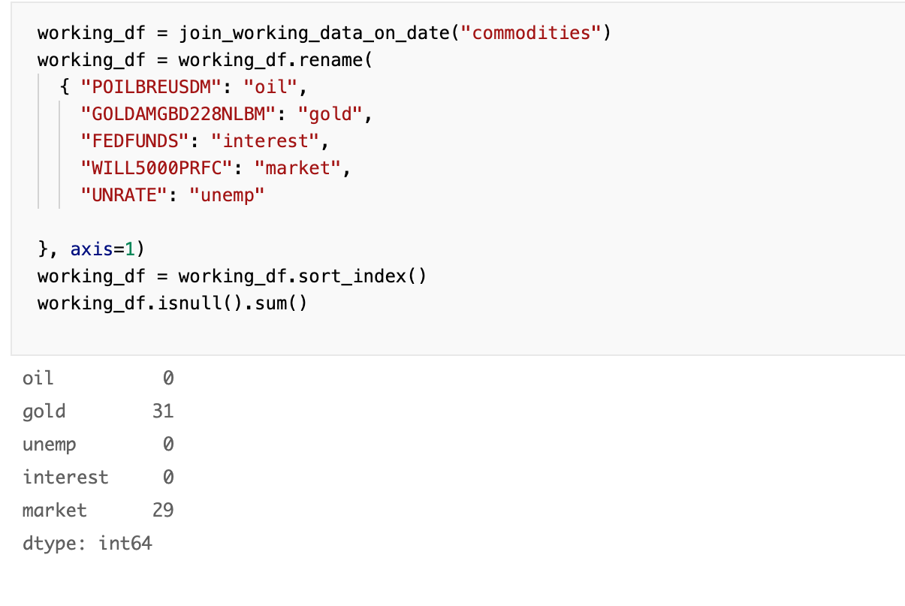

So to deal with this we do simple filling with padding from the previous
observation.

  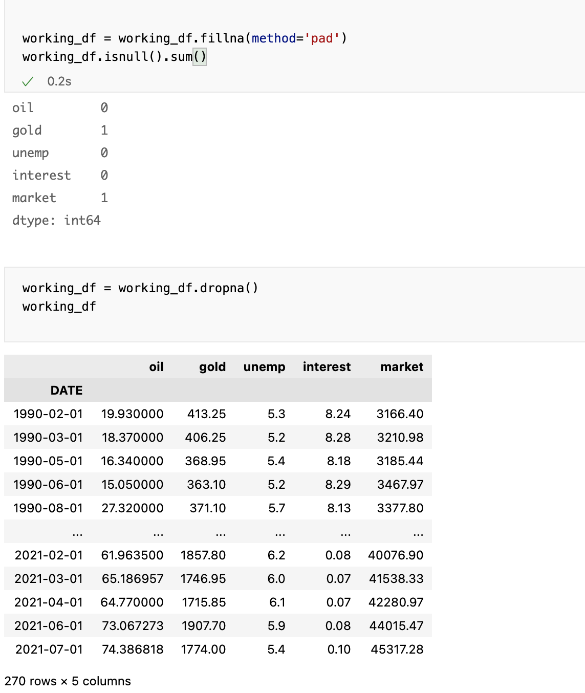

Now we can properly plot figure of all our series to get an idea how they
look over time

  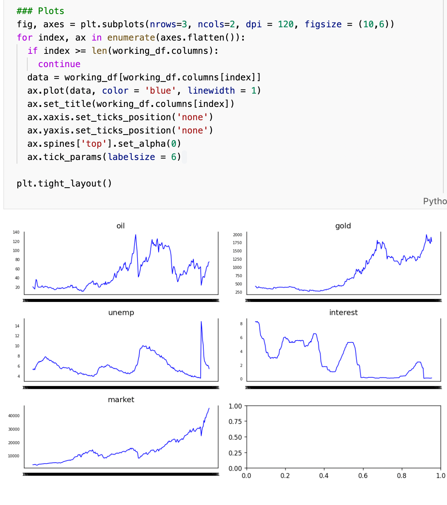

Just by glancing at each of the series we can see only unemployment has a chance
of being stationary with all other series displaying non-stationary behavior
To fit a VAR model and use Granger's test we want our time series to be
stationary and preferably our error term to be normally distributed. Using
*Augmented Dickey-Fuller Test* to test the null hypothesis that our series
is has unit root against the alternative that it is stationary.

  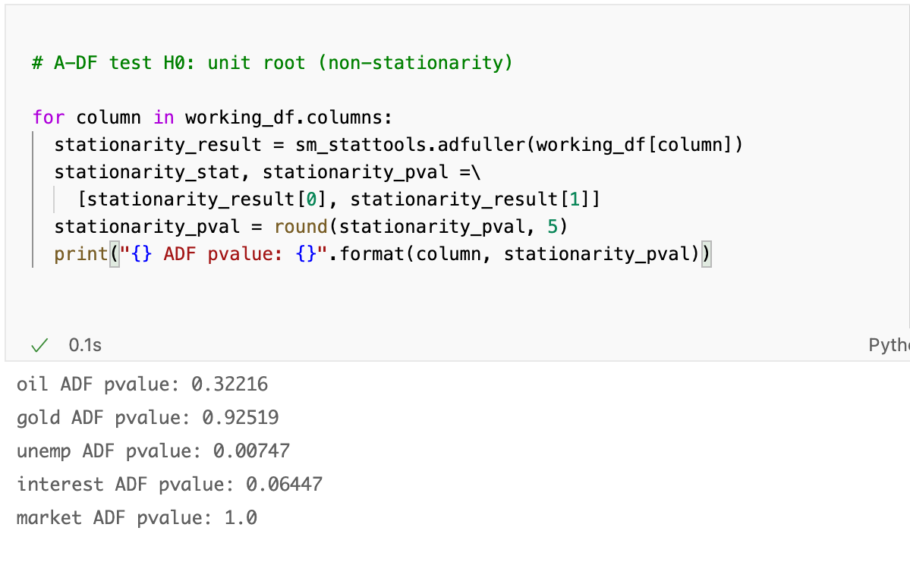

Given an $\alpha = 0.05$ as our p-value criterion for statistical significance
we see we can only reject the null hypothesis of unit-root for unemployment
series in favor of a stationary series. For the rest we will have to find find
$I(d), d > 0$, or the minimum number of differences to reach a
covariance-stationary time series. To do so we difference our series once and twice to look at the p-values of
$I(1)$ under the ADF test.

  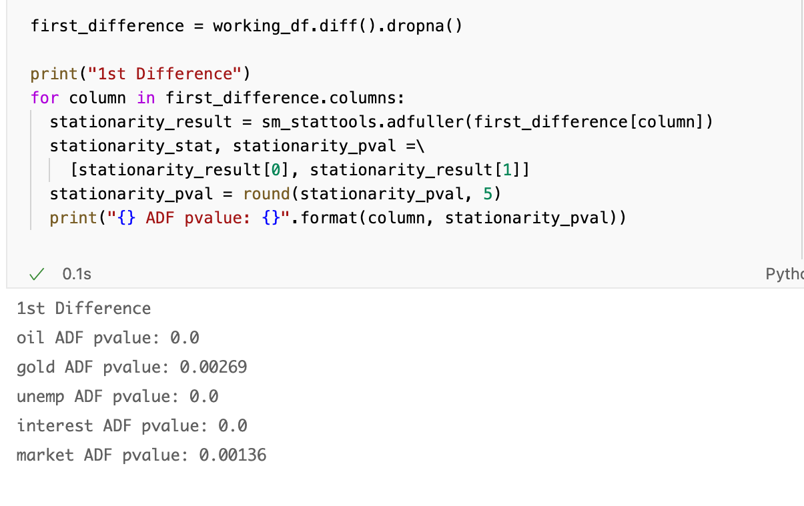

Under $I(1)$ the rest of our data now easily passes our $\alpha = 0.05$
criterion, we leave unemployment is $I(0)$.

The next step is to do a test of cointegration between the remaining variables,
given they all have the same coifficient of integration. If two series
are cointegrated they trend in tandem.

Here we will utilize *Johansen's Test* as it allows us to test cointegration
with a basket of time series giving us more freedom in how we fit our future
model. We will use the original dataset with an $AR(1)$ term in the test since
$I(1)$ processes can be represented as an $AR(1)$ process. The null hypothesis
is that there is no cointegration with the alternative being that there is at least the series is cointegrated
with at least one other series.

  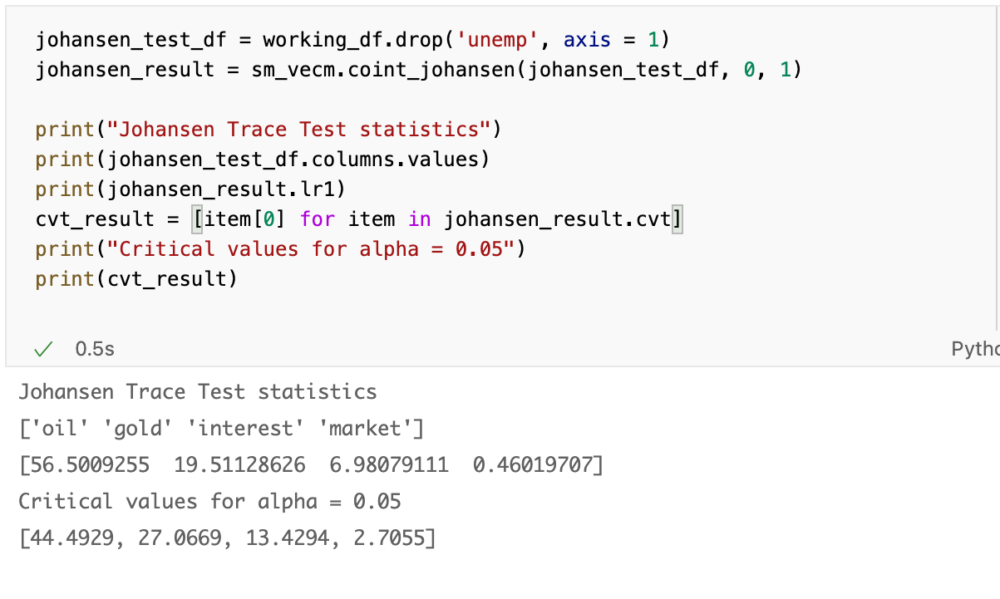

We can see above that $v_{oil}, > \alpha = 0.05$ hence we reject the null in
favor that oil prices is cointegrated with at least one other variable. The
rest of the variables failing to reject the null hypothesis hence we retain the
claim of no cointegration. Hence, as we used $AR(1)$ this implies
at either $oil_t$ or $oil_{t- 1}$ will trend with
$X_{t} = \beta_{1} gold_t + \beta_2 interest_t + \beta_3 market_t, \beta_i \in
\R$

Before moving to use Granger's test we want a clearer picture of the distribution
of the series over time. Given all we found a stationary
variant of all our series we can do a simple normality test. We will use
*Anderson Fuller's Test* to achieve this goal. The null hypothesis being
that the series is normally distributed

  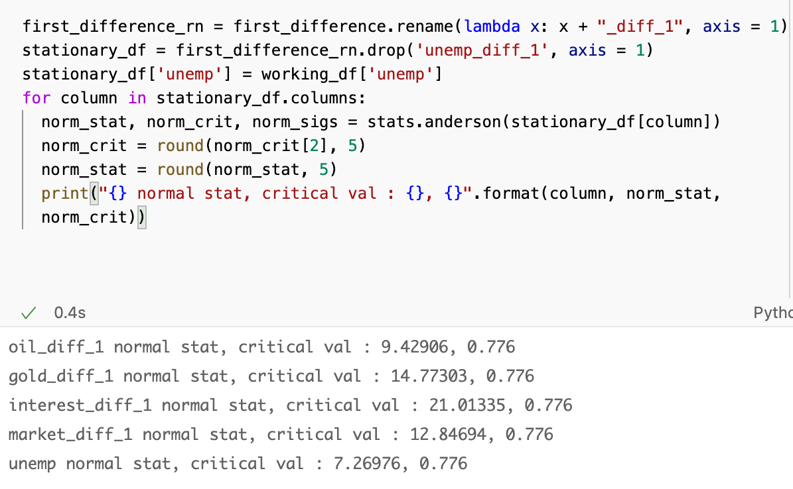

Above we see all test statistics are greater than the critical value. We below is a plot of our series so we can get a better
picture.

  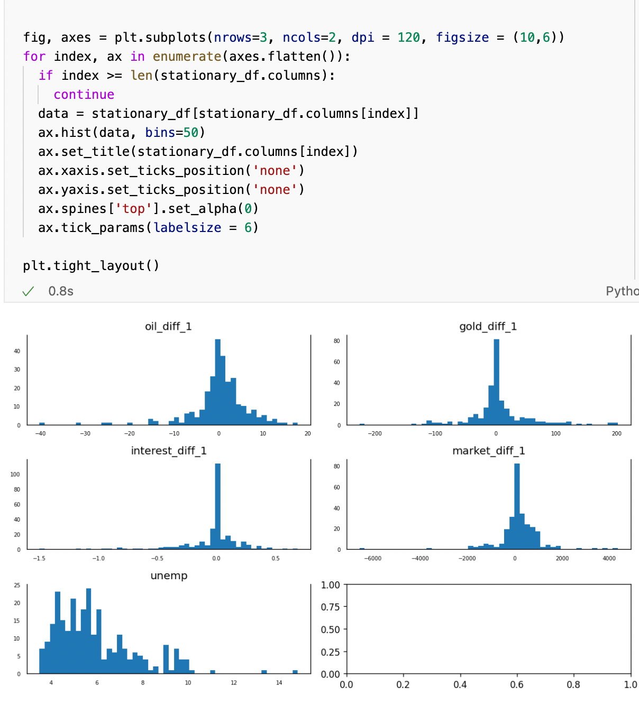

  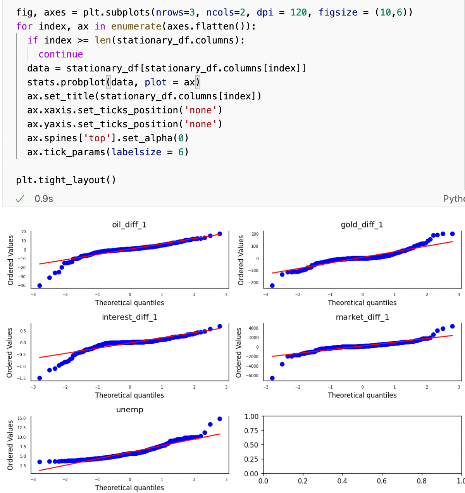

As we see above while the data does behave similarly to a normal distribution
both the skew and kurtosis seems to be far off from a normal distribution's.
Below we perform a skew test and a kurtosis test to get an idea.

  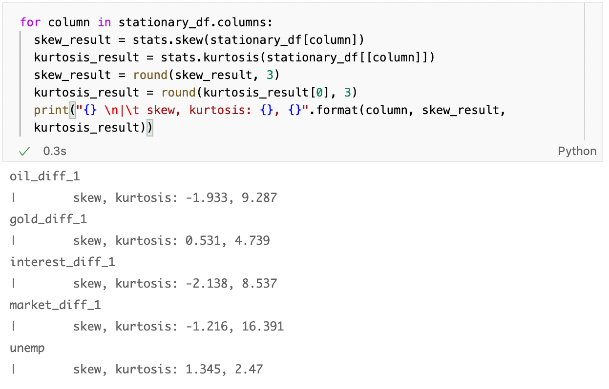

As kurtosis approaches infinity the data becomes concentrated at a single point.
When you difference white noise you would expect a very high kurtosis.
So with respect to our data the lower the kurtosis the easier it is to
extract actionable signals.

## Granger's Test and Fitting a model

Now that we have a general idea how well behaved our data is we can
move towards actually fitting a model for forecasting gold prices.
First we will perform Granger's test with the null hypothesis that the
series, $X_t$, does not have a statistically granger casual effect on
our series of interest, $Y_t$. We will use our first differenced gold series as
$Y_t$ and the rest of our stationary data as $X_t$

  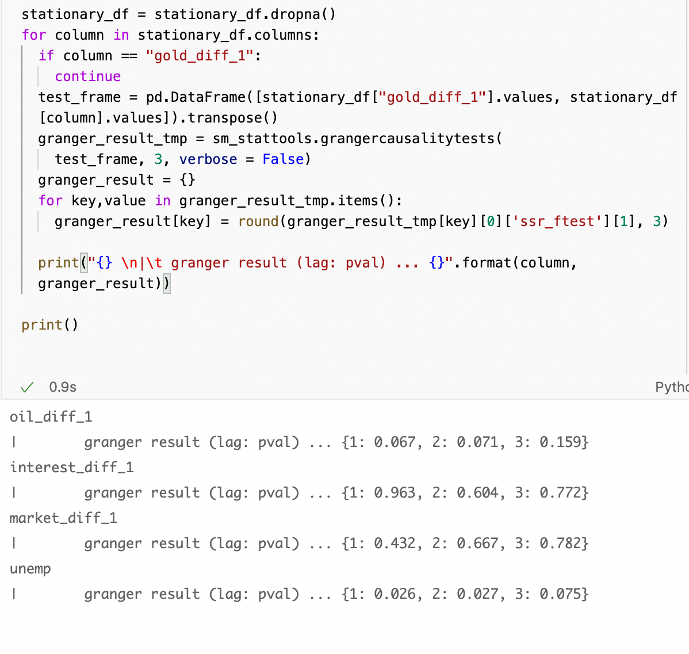

We see that only unemployment has granger casual relationship on first
differenced gold value at $\alpha = 0.05$ at lags 1 and 2.  With only first
differenced oil under having a debatable granger casual relationship on the
of first differenced gold. Given the first differenced value of gold essentially
means the movement between two timesteps of gold we can simplify the above
statement to say that unemployment level has a statistically significant granger
casual relationship on the movement of gold at lags 1 and 2 and the price
movement of Oil having a debatable relationship at lags 1 and 2. Furthermore
the movement of interest and market prices significantly fail to reject the
null hypothesis and hence we fail to establish a granger casual relationship
between them and the price movement of gold.

Now moving forward we can fit a VAR to see how well we can predict the gold
movement. Given our data is stationary we can proceed with our analysis
directly. Instead of using the strength movement forecast directly we can
extract actionable information from just the direction of movement.  Hence our
error heuristics is if our model could correctly predict the direction of
movement one step ahead. We will using a sliding window to gradually forecast 1
step ahead
for 100 time steps.

  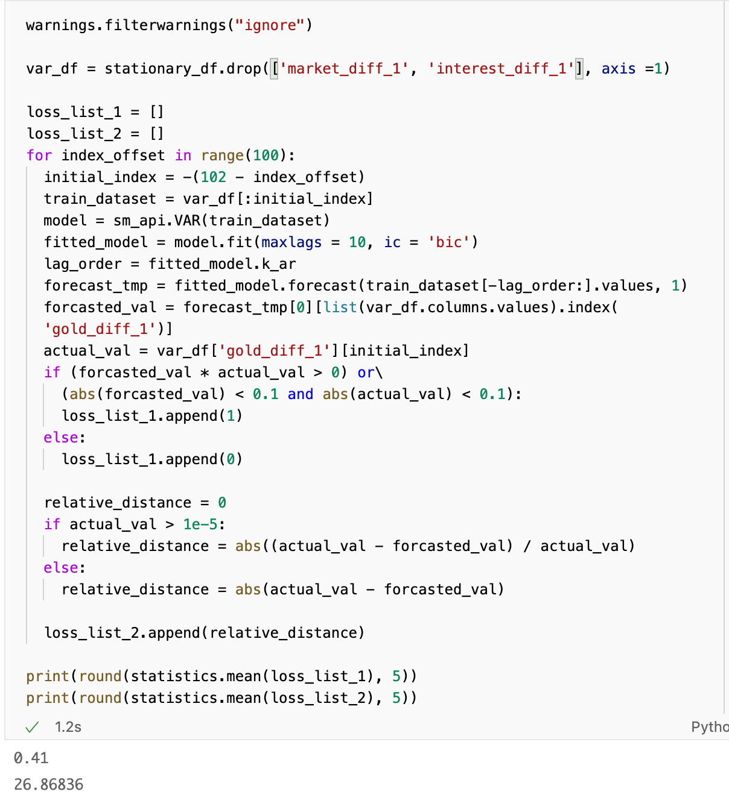

Above we can see we only predicted the movement 41% of the time, which is not
too good, this makes sense however, as it implies that there is more factors
at play in the price movement of gold. This does however tell us that
our model would not be sufficient as being able to predict movement of a time
series better than random guessing is the base standard for a useful model.

If we utilize all of our stationary data rather than our Granger
casual variables we get.

  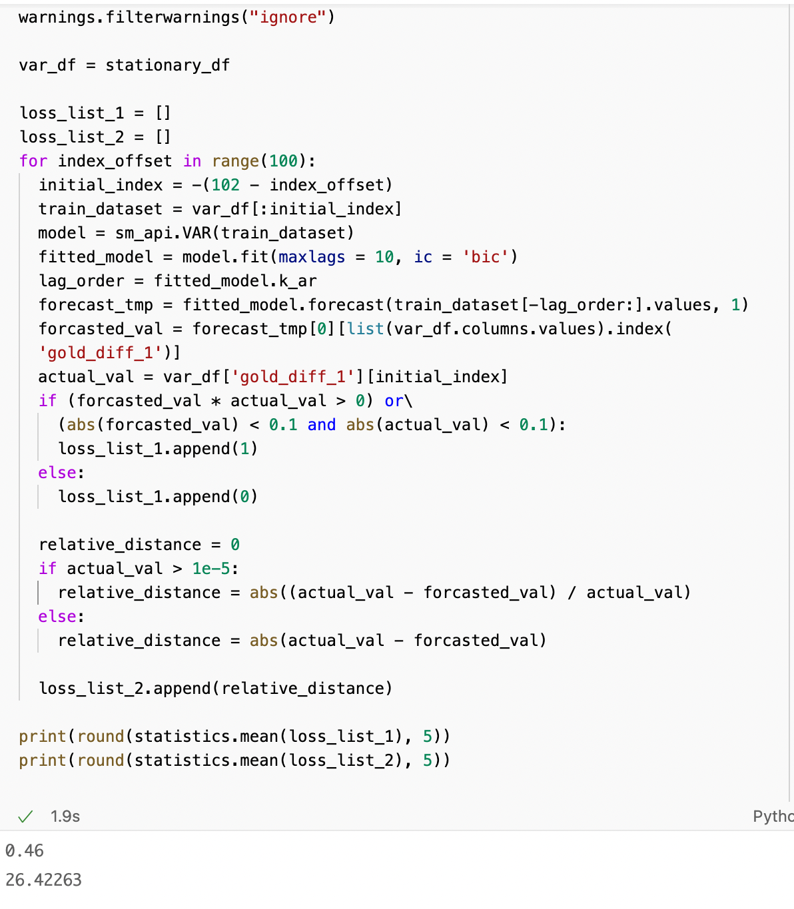

Above we see an improved ability in terms of prediction despite including
variables that are significantly not granger casual. Hence we can stipulate
that Granger causality is not a good criterion on fitting a model itself and
further tests are required to fit a time series based on financial instruments.

## References
- http://www.scholarpedia.org/article/Granger_causality
- https://en.wikipedia.org/wiki/Granger_causality
- https://en.wikipedia.org/wiki/Johansen_test
- https://en.wikipedia.org/wiki/Humean_definition_of_causality

## Data Sources

- https://fred.stlouisfed.org/series/
